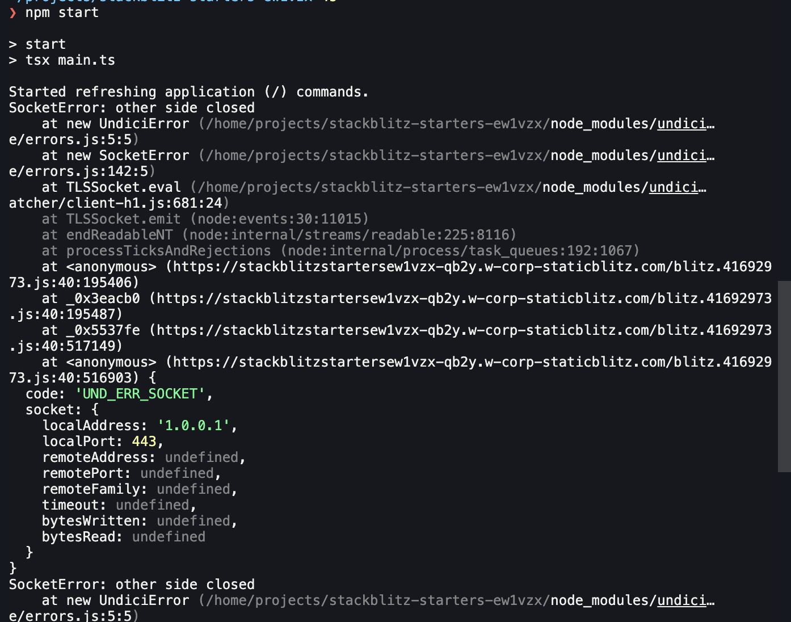
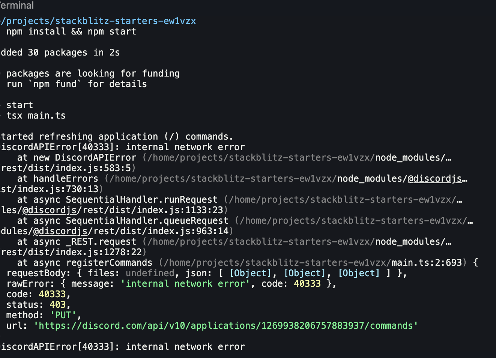
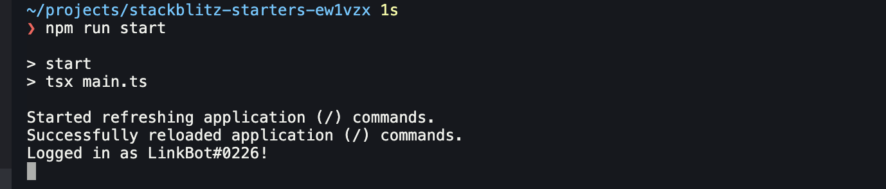
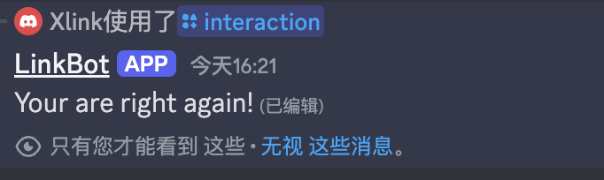

最近接触到了Discord Bot开发，也大概了解了开发一个Bot的流程，既然整个bot开发都能给予nodejs来完成，那么理论上使用stackblitz这个平台就能胜任，这样只需要一个chromium浏览器就能搞定了，岂不美哉？

说干就干，我立马新建了一个项目到stackblitz上，npm install一气呵成，没有什么问题。
但是一旦运行起来，就出大问题了，报错了

很明显，这是网络请求出了问题，虽然stackblitz模拟了一套nodejs底层，但是比较还是跑在浏览器里，不可避免地会受到跨域限制。
解决跨域问题很简单，在mac上，通过一道命令就可以简单地接触跨域限制
```
open -na Google\ Chrome --args --user-data-dir=/tmp/temporary-chrome-profile-dir --disable-web-security --disable-site-isolation-trials
```
不过这么做会新开一个chrome窗口，而如果我想继续用原来的chrome用户配置呢？也很简单，装一个插件就行了[Allow CORS](https://chrome.google.com/webstore/detail/lhobafahddgcelffkeicbaginigeejlf)
>>PS：stackblitz平台本身也支持绕过cors，不过是通过转发请求到代理解决的，因此需要订阅他的Team计划才可以使用
测试一下，开启cors后可以访问到其他网站了，再运行试试呢？


还是报错了，这下有点奇怪了，赶紧去搜一下解决方法。

在github上找到了这个讨论，原来有前人发现过这个问题[Using DiscordBot from React app](https://github.com/discord/discord-api-docs/issues/2078#issuecomment-697829305)，也有人给出了问题出现的原因：Discord官方对http请求做了限制，user-agent必须要满足要求：[https://discord.com/developers/docs/reference#user-agent](https://discord.com/developers/docs/reference#user-agent)

这也好办，chrome也有插件支持改UA：[user-agent switcher](https://chromewebstore.google.com/detail/bhchdcejhohfmigjafbampogmaanbfkg)，把UA改成```Discord Bot```应该就可以了

不过还有个小问题，改了UA之后stackblitz识别不出我们的浏览器了，需要先改回去，等页面加载完在改成bot UA才行，这个也无伤大雅。我找了好久也没找到能在单个tab内分别针对不同域名配置不同UA的插件，暂且先手动修改吧。

一番配置后再次运行，这下总算成功了，Discord Bot顺利在浏览器内运行起来了，并且能够正常回复我们在Discord APP里发送的指令，大功告成。




虽然说这个方法是用来解决特定场景的开发需求，但是鉴于stackblitz本身作为web开发的最佳工具的地位，移除CORS和UA代理应该可以作为Nodejs的通用解决方案，要是能整合一下做成一个插件，一键启动就好了。